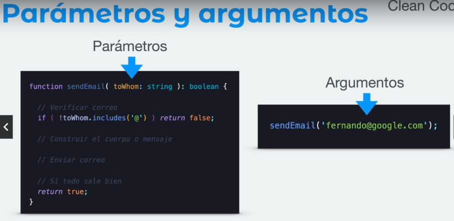
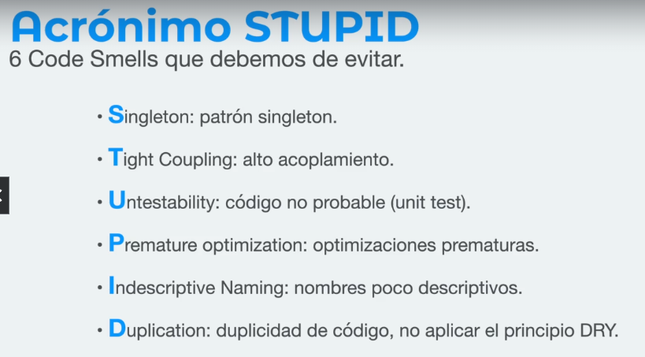
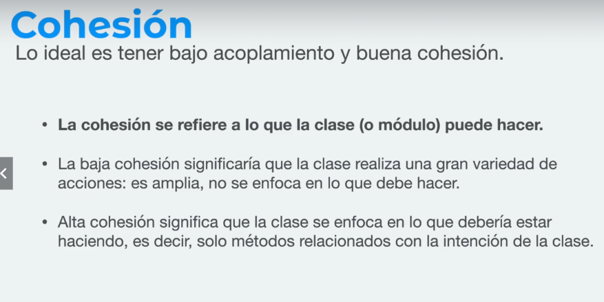
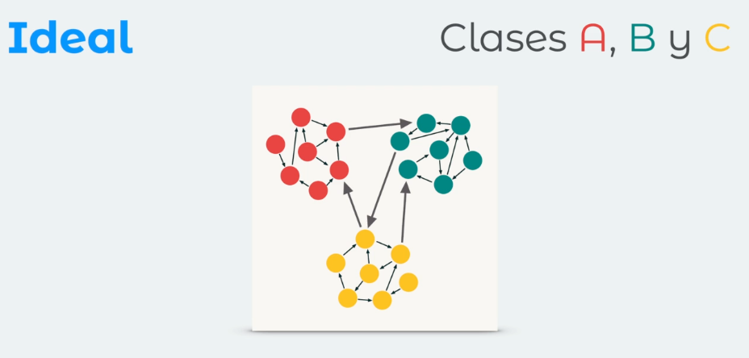
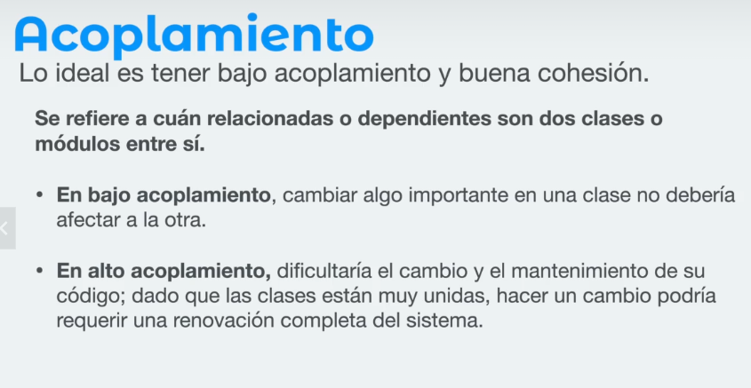

# Proyecto para practicar

Este es un proyecto de Vanilla TypeScript en Vite, para trabajar los ejercicios del curso sobre Principios SOLID y CleanCode.

"Código limpio es aquel que se ha escrito con la intención de que otra persona (o tu mismo en el futuro) lo entienda"- Carlos Blé

"Nuestro código tiene que ser simple y directo, debería leerse con la misma facilidad que un texto bien escrito" -Grady Booch

"Programar es el arte de decirle a otro humano lo que quieres que la computadora haga" -Donald Knuth

Clonar o descargar el proyecto y luego:

- parámetros /argumentos 


- Acrónimo STUPID 


- Cohesión 


Estamos buscando concretamente que nuestras clases o componentes 
todo lo relacionado entre si este relacionado y cuando se requiera conexión haya canales fáciles de mantener
 

*** Recordar: Un buen diseño de software tiene una alta cohesión y un bajo acoplamiento  



```
yarn install
ó
npm install
```

Para ejecutar el proyecto, simplemente ejecuten
```
yarn dev
ó
npm run dev
```