# Proyecto para practicar

Este es un proyecto de Vanilla TypeScript en Vite, para trabajar los ejercicios del curso sobre Principios SOLID y CleanCode.

"Código limpio es aquel que se ha escrito con la intención de que otra persona (o tu mismo en el futuro) lo entienda"- Carlos Blé

"Nuestro código tiene que ser simple y directo, debería leerse con la misma facilidad que un texto bien escrito" -Grady Booch

"Programar es el arte de decirle a otro humano lo que quieres que la computadora haga" -Donald Knuth

Clonar o descargar el proyecto y luego:

- parámetros /argumentos 


- Acrónimo STUPID 


- Cohesión 


Estamos buscando concretamente que nuestras clases o componentes 
todo lo relacionado entre si este relacionado y cuando se requiera conexión haya canales fáciles de mantener
 

*** Recordar: Un buen diseño de software tiene una alta cohesión y un bajo acoplamiento  


-Código no probable 
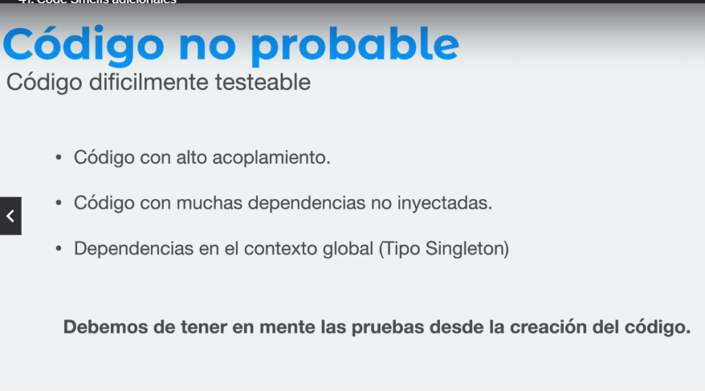


- Optimizaciones prematuras 
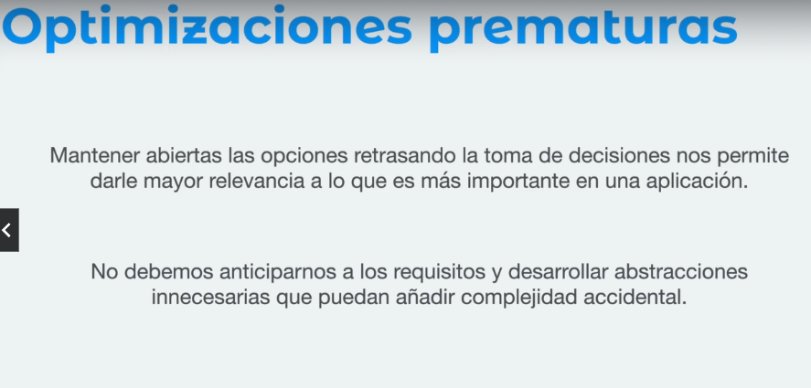
implementamos una solución compleja a la minima indispensable 

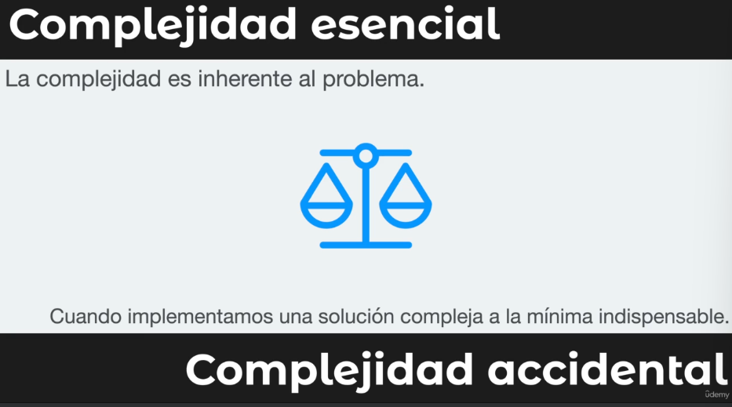
Es necesario encontrar un balance entre ambas complejidades. 

- Nombres poco descriptivos: 
-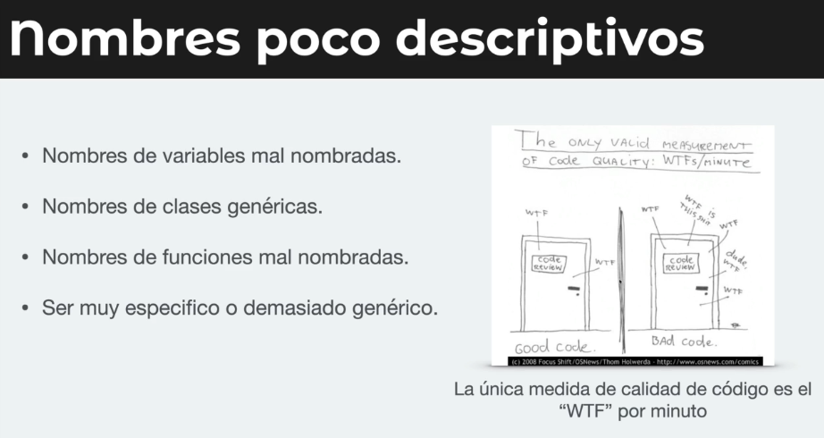

- Duplicidad de código 
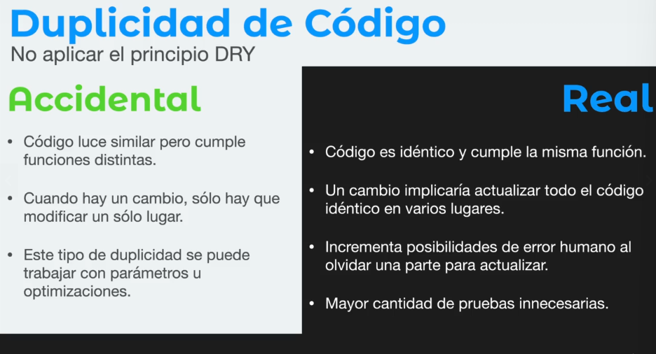

- Métodos grandes ... lo que se puede hacer es hacer más pequeño
en pequeños submetodos que hagan una tarea especifica y la haga bien
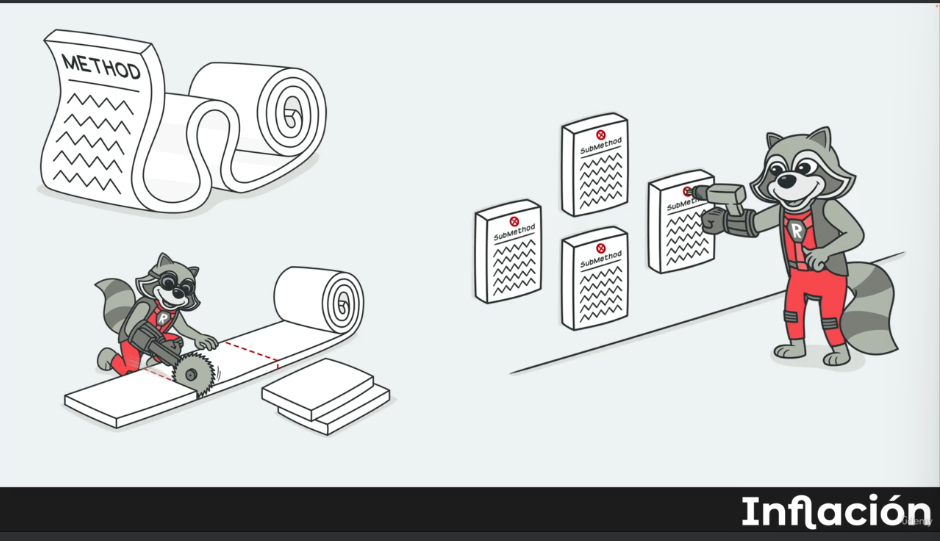

- Si una clase  hace muchas cosas se puede subdividir en pequeñas subclases o métodos pero que lo haga correctamente 
- evita dublicidad de código
- favorece la reutilización 
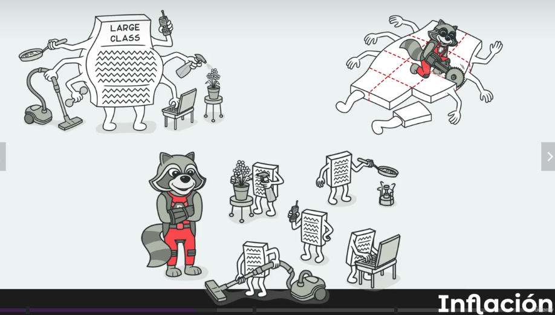 

- Si hay mucha cantidad de variables de datos primitivos, se reemplace en un objeto y permita reutilizar los modulos
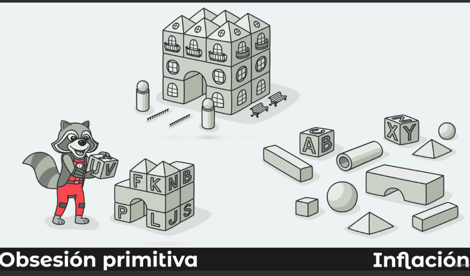

- Lista larga de parámetros: más de 3 - 4 argumentos en un método
se puede pasar el objeto mismo como argumento, en vez de muchos pequeños 
si los elementos no son relacionados podemos crear un objeto que los integre 
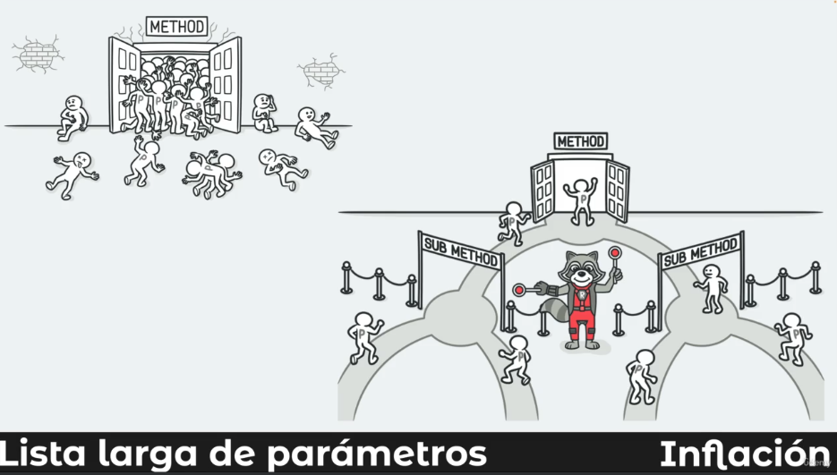

- Las buenas clases deben saber lo menos posible de otras clases 
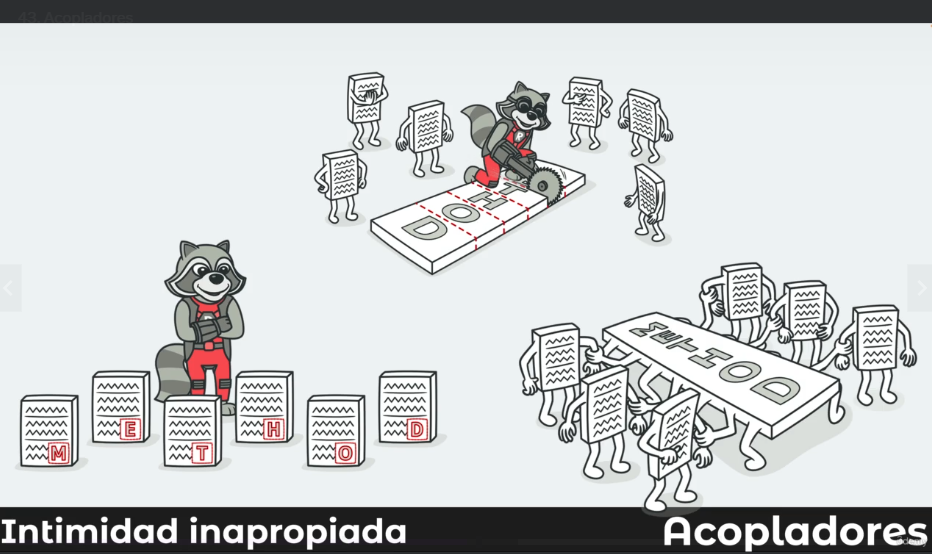

- Cadena de mensajes: Función o módulo que  solicita a otro y a otro y otro
dependiendo de la navegación de estructuras o módulos, creando canales de comunicación complejos 
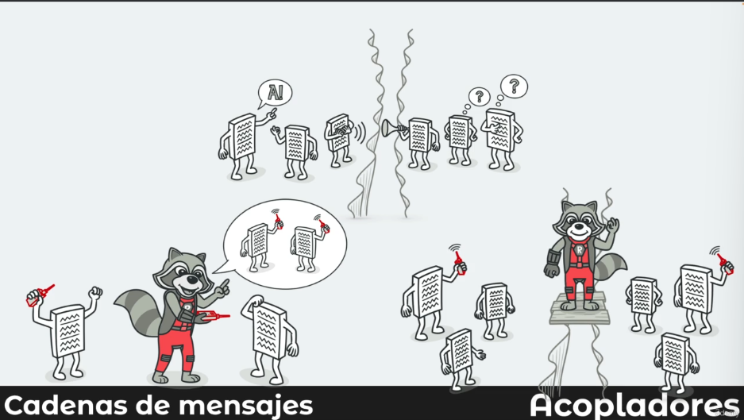

 esto reduce la dependencia de la comunicación y la cantidad de código 

- Middle man : es bueno evitar cadna de mensajes intermedios (muchas  veces resultado de la refactorización anterior)
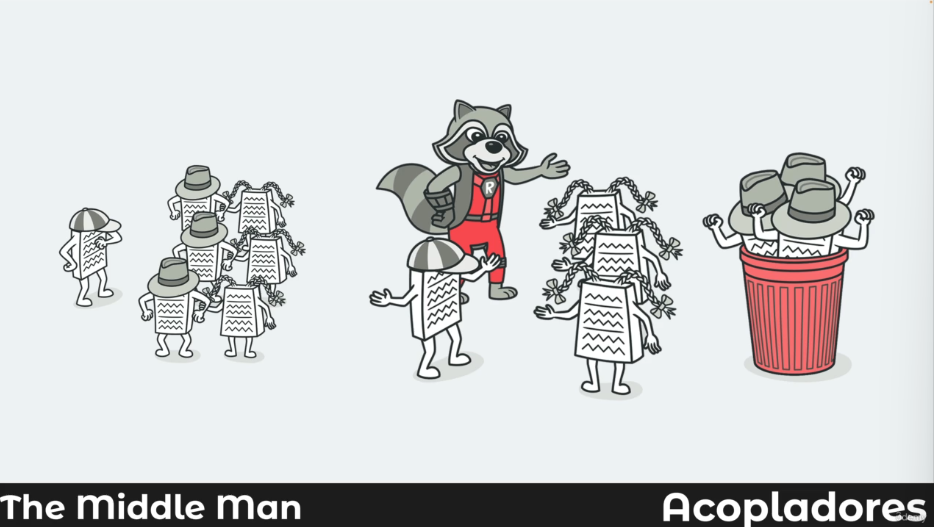

Principios S.O.L.I.D.

Cada principio básicamente cuenta de 3 partes, una exposición, un ejercicio y cómo detectar violaciones al principio, algunos son bastante obvios y otros tienen un poco más de complejidad, pero no dejen que los nombres los asusten, son fáciles de comprender con la práctica.


Los 5 principios S.O.L.I.D. de diseño de software son:

Nos indican cómo organizar nuestras funciones y estructurasde datos en componentes y como dichos componentes deben estar interconectados. 

Son recomendaciones decómo hacer mejor las cosas: 

S – Single Responsibility Principle (SRP)

O – Open/Closed Principle (OCP)

L – Liskov Substitution Principle (LSP)

I – Interface Segregation Principle (ISP)
establece que los clientes no deberían verse forzados a depender de interfaces que no utilizan

D – Dependency Inversion Principle (DIP)

Y en esta sección hablaremos sobre cada uno de ellos.

S- Responsabilidad única: 
"tener una única repsonsabilidad" !== "hacer una única cosa"
sino que en diseñar componentes que solo estén expuestos a una fuente de cambio


```
yarn install
ó
npm install
```

Para ejecutar el proyecto, simplemente ejecuten
```
yarn dev
ó
npm run dev
```